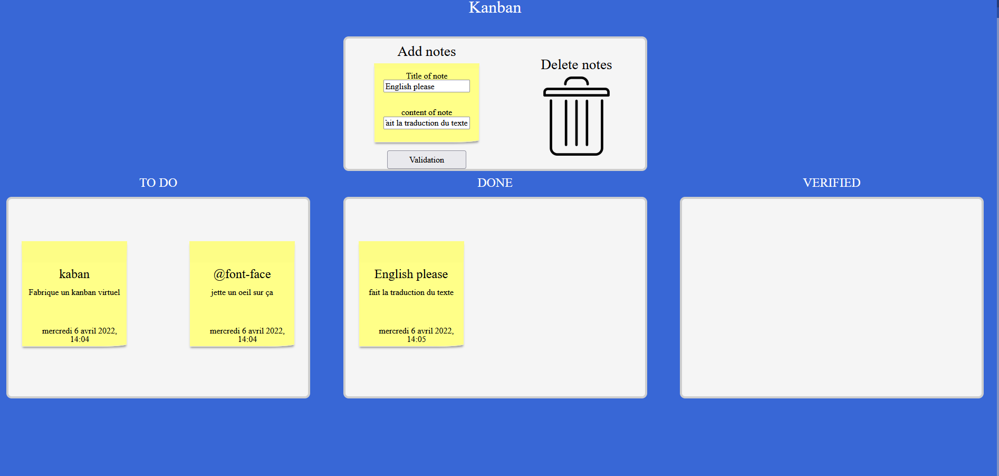

# PocNote
Projet de kanban simple a multiple, colonne.
Le projet est non finis, il manque des fonctionalité.
Vous allez forker le projet et ajouter une fonctionalité au choix.
Certaine son simple d'autre complexe, faite en sorte d'être cohérent avec le projet.

Pour le moment le projet fonctionne avec localStorage.
La v2 est en cours de préparation et fonctionnera avec une bases de données  

Toutes les cases non cocher dans la todo list sont des fonctionalité à ajouté au programme.

## Diagramme

## TODO LIST (elle permet de voir les amélioration possible)
- [ ] Exercice kanban qui regroupe plusieur technologie  
    - [x] Ajout de note avec un form
        - [ ] Design potable du formulaire  
        - [x] Titre de la note  
        - [x] contenus de la note  
        - [ ] choix de couleur pour la note ?  
    - [x] Drag and drop  
        - [x] possibilité de déplacer une note d'une section à une autre   
        - [x] Créée une zone de drop qui supprime une note  
        - [ ] Etes vous sur ? possibe ou pas ?   
    - [x] Local Storage  
        - [x] Sauvegarde de l'état des note ("trash", "todo", "done", "verfied")  
        - [ ] Sauvegarde de la colonne   
    - [x] Class et objet   

- [x] Ajouter la suppression de note  
- [ ] Ajouter la suppresion des input lors de la validation  

